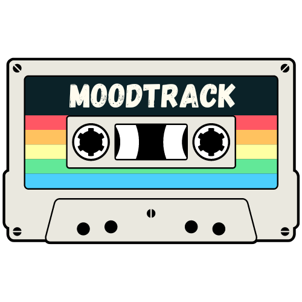

MoodTrack is a Full Stack app that encourages daily mood check-ins and recommends a song from the Spotify catalogue based on users’ mood inputs.

Developing a number of features, including:
- Authentication with existing Spotify accounts.
- A mood check-in / track finder page that allows users to reflect and measure their daily mood using interactive sliders. The inputs are used to generate a random track from the Spotify API. Also in the Web version. 
- A playlist creator where users can take up to 100 of the latest song recommendations and add them to a Spotify playlist.
- A mood tracker which allows users to select any seven day period and generate line charts based on their historic mood inputs.
